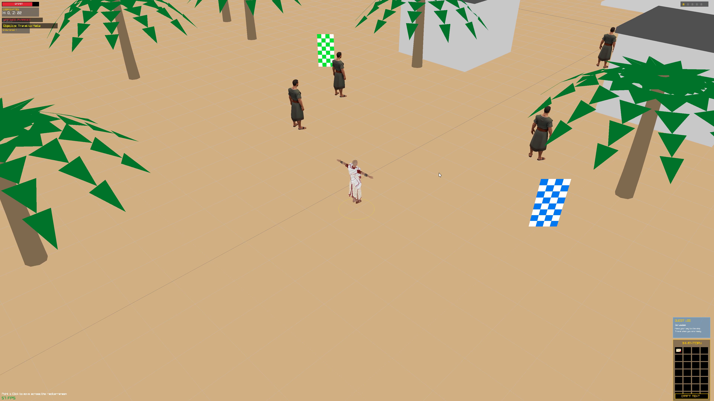
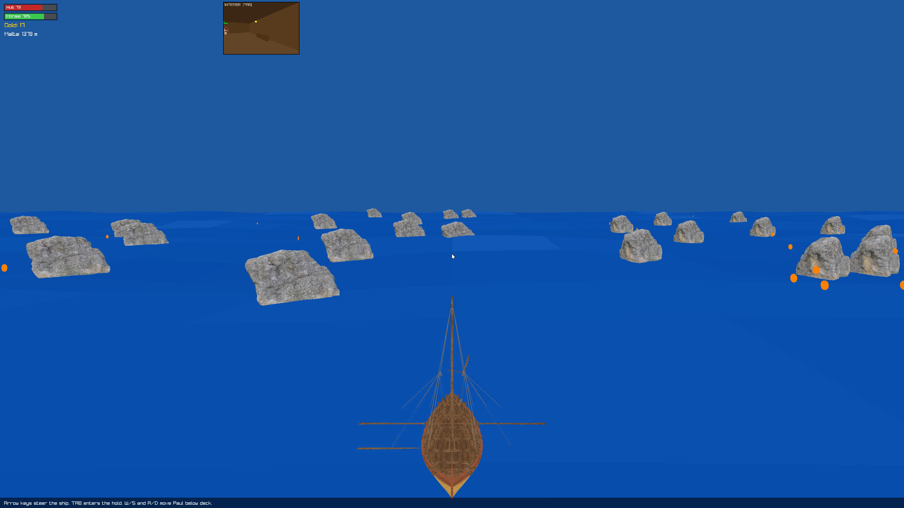
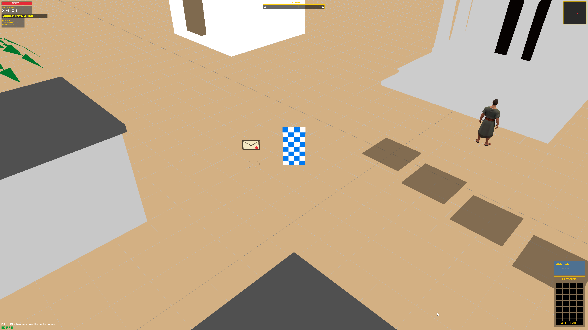
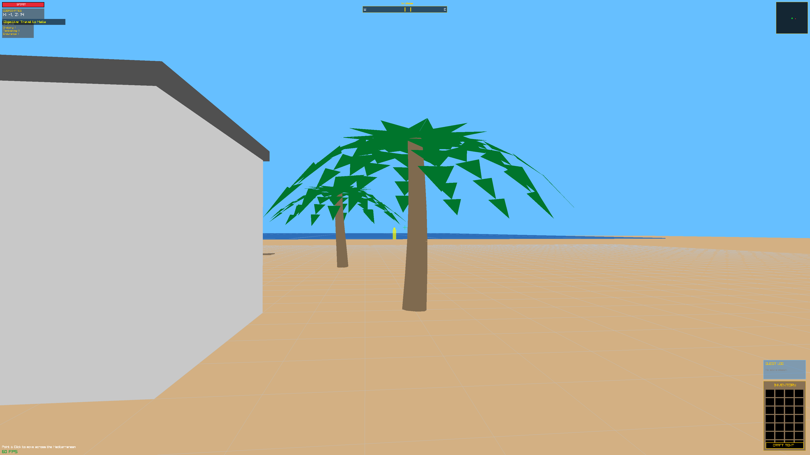
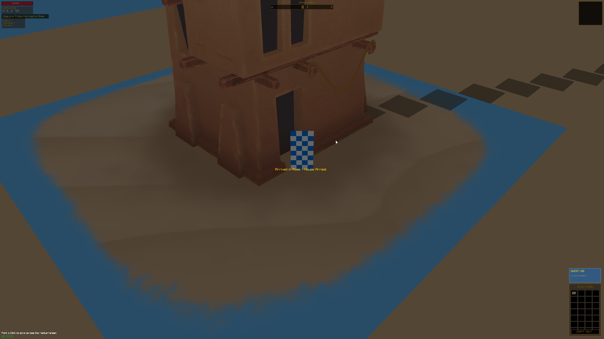

# St. Paul's Postal Service

An interactive RPG built with C and Raylib, following the journeys of St. Paul.

## Screenshots











## Features

- **Dual Perspective System:**
  - **F1 (First-Person):** Modern FPS-style controls with smooth WASD movement, mouse-look rotation, and a crosshair for interaction.
  - **F3 (Isometric):** Classic point-and-click movement using BFS pathfinding, with optional WASD/Arrow key support.
- **World & Interaction:**
  - Dynamic tile-based world with robust obstacle detection (buildings, rocks, temples).
  - Interactive NPCs with dialogue trees and combat sessions.
  - Resource collection and crafting (e.g., crafting a tent from logs and canvas).
- **RPG Systems:**
  - **Quest System:** Support for multi-state quests (e.g., "The Antioch Scroll").
  - **Skills & XP:** Levelling system for various skills including Tentmaking and Oratory.
  - **Inventory Management:** Slot-based inventory system for managing items and materials.
- **Dynamic UI:**
  - Responsive HUD with health/spirit bars, skill lists, and inventory, all relative to screen size.
  - Contextual interaction for movement, talking to NPCs, and picking up items.

## Installation & Running

1. Ensure you have `raylib` and its dependencies installed on your system.
2. Run the build script:
   ```bash
   ./build
   ```
3. Alternatively, compile and run manually:
   ```bash
   ./main
   ```

## WebAssembly Build

The `webassembly` branch adds a browser target for the main game.

1. Install and activate the Emscripten SDK so `emcmake` and `emcc` are on your `PATH`.
2. Build the web version:
   ```bash
   ./build-web
   ```
   The default browser build is the lightweight web version without the GLB model bundle. To force the same mode explicitly:
   ```bash
   ./build-web lite
   ```
   To build the heavier browser version with the preloaded GLB assets:
   ```bash
   ./build-web full
   ```
3. Serve the generated files:
   ```bash
   python3 -m http.server --directory out-web-lite/site 8080
   ```
4. Open `http://localhost:8080/main.html`.

Notes:

- `./build-web` now defaults to the lighter browser build without the GLB model preload.
- `./build-web full` restores the used GLB model files for the main world and voyage minigame.
- The custom desktop shadow shader path is disabled on web for compatibility, so the game stays playable even though the browser build does not render the desktop shadow pass.
- Voyage audio is disabled on web to keep the browser payload small and fast to load.
- In browsers, `F1`, `F2`, `F3`, and `F5` also work as `1`, `2`, `3`, and `5` after the canvas is focused.

## GitHub Pages

This repository now includes a GitHub Actions workflow at `.github/workflows/deploy-pages.yml`.

- Pushes to the `webassembly` branch build the lightweight web version and publish `out-web-lite/` to GitHub Pages.
- Pushes to the `webassembly` branch build the lightweight web version and publish `out-web-lite/site/` to GitHub Pages.
- The workflow writes a `CNAME` file for `spps.minions.tv`.
- The build output also includes `.nojekyll` and `index.html`, so the site can be served directly from the root URL.

## Controls

- **F1:** Switch to First-Person mode.
- **1 (web alias):** Switch to First-Person mode in browsers that reserve `F1`.
- **F2:** Toggle the desktop shadow shader path.
- **2 (web alias):** Browser alias for `F2`.
- **F3:** Switch to Isometric (3rd Person) mode.
- **3 (web alias):** Browser alias for `F3`.
- **F5:** Toggle shader debug UI.
- **5 (web alias):** Browser alias for `F5`.
- **WASD / Arrow Keys:** Move player.
- **Shift:** Sprint on foot and boost repairs/morale during the voyage.
- **Mouse (F1):** Look around.
- **Left Click:** Interact with NPCs, items, or move (in F3 mode).
- **ESC:** Exit.
