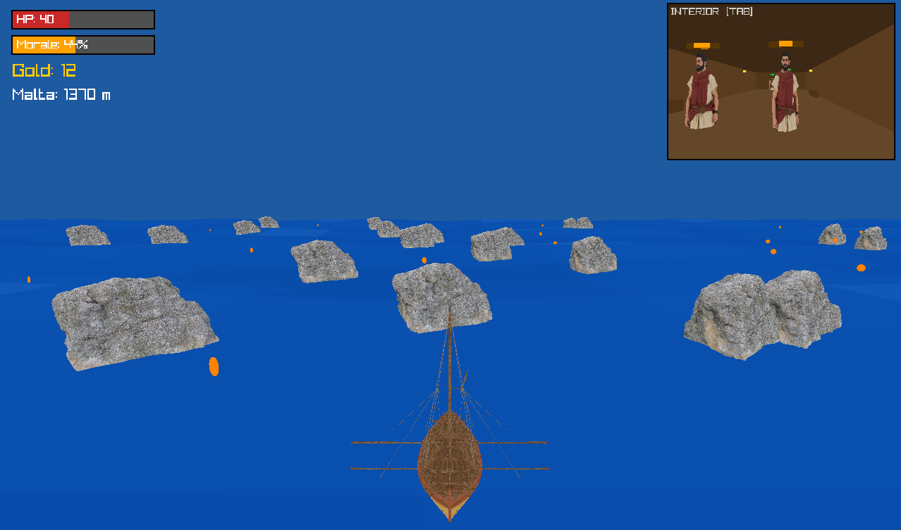
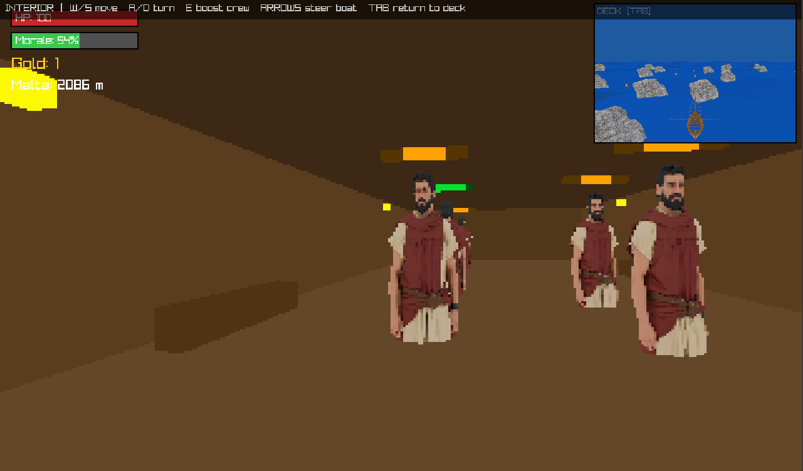

# ⛵ Saint Paul's Postal Service: Voyage Level

> *One leg of Saint Paul's legendary journey — sail from open sea to Malta, keep your crew's spirits high, dodge the rocks, and collect every gold coin you can.*

---

<p align="center">
  
  &nbsp;&nbsp;
  
</p>

---

## 🎮 Overview

**Voyage** is a single-level 3-D sailing game built with [raylib](https://www.raylib.com/) and C. You captain a Roman-era vessel crossing the Mediterranean, managing both the helm and your crew's morale — two things that can sink you just as fast as the rocks.

The level is part of the broader **Saint Paul's Postal Service** game, which recreates stages of Saint Paul's historical voyages. The Voyage level covers the open-water crossing to Malta (Acts 27), where the ship faces storms, treacherous coastline, and a crew on the edge of mutiny.

---

## 🕹️ Controls

| Action | Key |
|---|---|
| Steer boat left / right | `← →` Arrow Keys |
| Move (interior) | `W / S` |
| Turn (interior) | `A / D` |
| Boost nearest crew member's morale | `E` |
| Toggle interior ↔ deck view | `Tab` |
| Exit end screen | `Enter` / `Space` / `Esc` |

> Arrow keys steer the boat **at all times**, even while you're walking around below deck.

---

## 🎯 How to Play

### The Deck View
The default view puts you behind the boat on the open ocean. Your vessel sails **automatically westward** toward Malta — your only job is to steer left and right to avoid hazards and collect treasure.

- **Rocks** spawn ahead of you and must be dodged. Each collision drains your hull HP.
- **Gold coins** spin and glow on the water — steer into them to collect them.
- **The island of Malta** appears on the horizon as you close in. Reach it to win.

### The Interior View (Press `Tab`)
Pressing `Tab` takes you below deck into the crew quarters. Here you can walk around and interact with your crew.

- Your crew members **patrol the cabin** and their morale **drains over time**.
- Walk up to a crew member and press **`E`** to give them a morale boost.
- The ocean mini-window (top-right) keeps the deck visible so you never lose track of hazards.
- The boat keeps sailing and the arrow keys still steer while you're below deck.

---

## ⚠️ Ways to Lose

| Condition | What Happens |
|---|---|
| Hull HP hits 0 | **Game Over** — the ship sinks |
| Overall crew morale hits 0 | **Mutiny!** — the crew takes over |

Balancing time on deck (avoiding rocks) with time below deck (boosting morale) is the core tension of the level.

---

## 🏆 How to Win

Survive long enough for the ship to reach the Malta coastline. When you cross it, the game ends with a victory screen showing your total gold collected.

**Tips:**
- Gold doesn't help you win directly, but it's the final score on the victory screen.
- Morale drains constantly — don't ignore your crew for too long.
- Rocks spawn ahead of you; staying near the center of the lane gives you more reaction time.

---


## 🔨 Building

```bash
# Create build/ directory (Windows)
mkdir build
cd build

# From the build/ directory (MinGW / Windows)
mingw32-make

# Run
.\game.exe
```

Requires **raylib** linked via CMake. See `build/CMakeLists.txt` for configuration.

---

## 🌍 Context: Saint Paul's Postal Service

This level is one stage in **Saint Paul's Postal Service**, a larger episodic game following Paul of Tarsus on his historical journeys across the ancient Mediterranean world. Each level recreates a leg of Paul's travels — from city visits and trial scenes to this open-water crossing to Malta.

The Voyage level ends when you reach Malta. What happens after you land is the next chapter.

---

*Built with [raylib](https://www.raylib.com/) · C · OpenGL*
